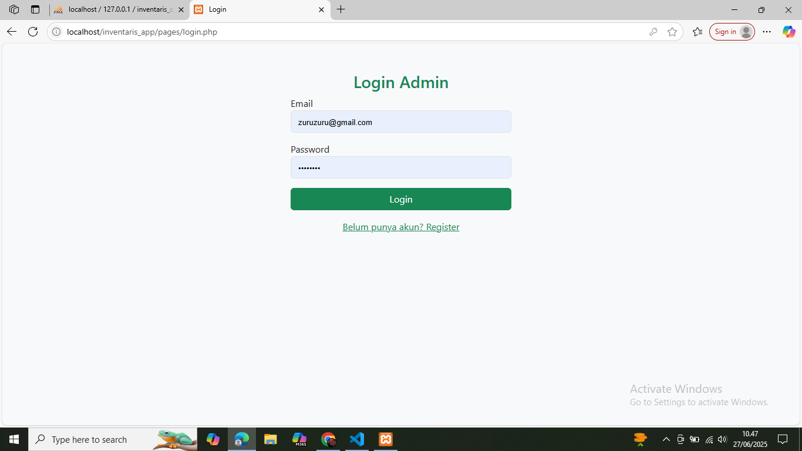
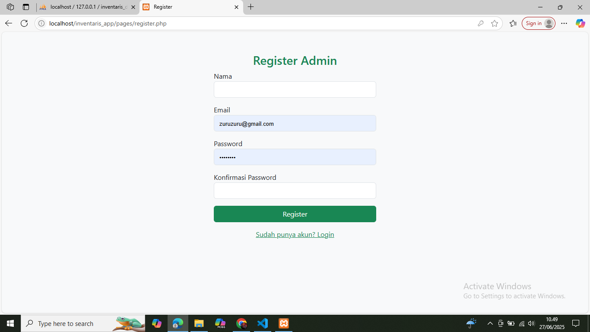
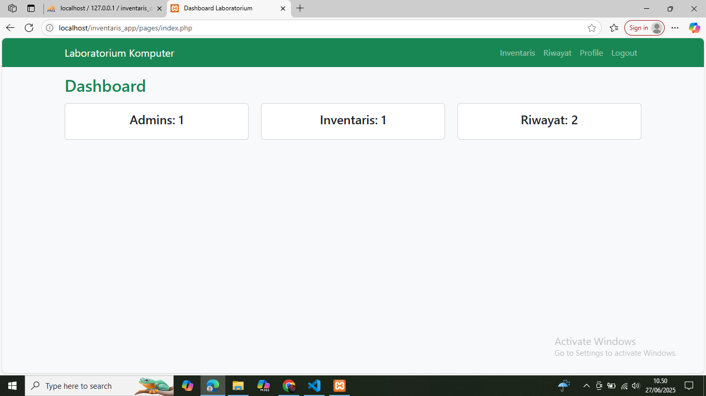
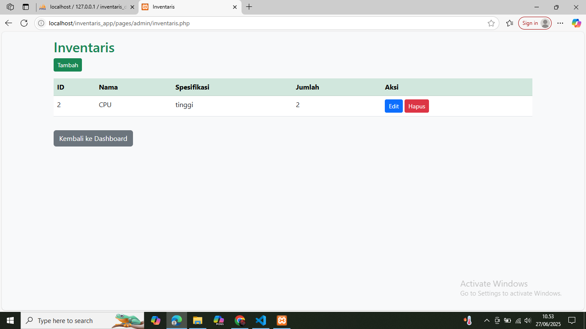
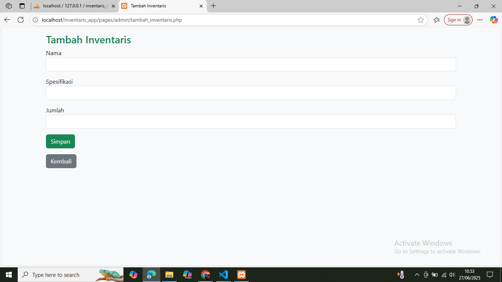
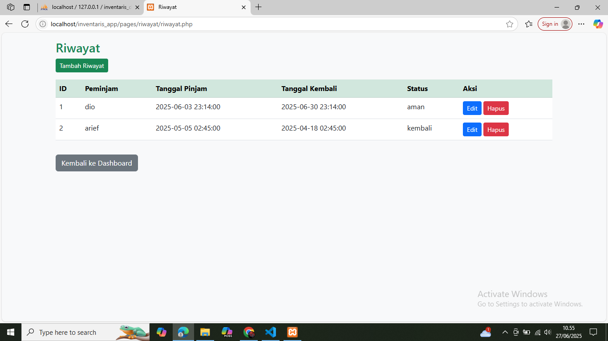
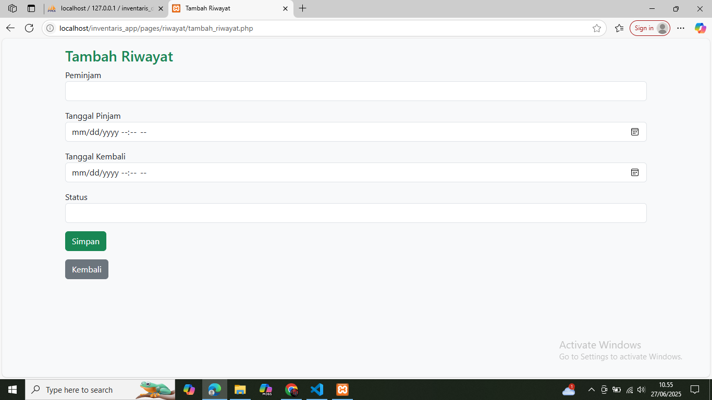
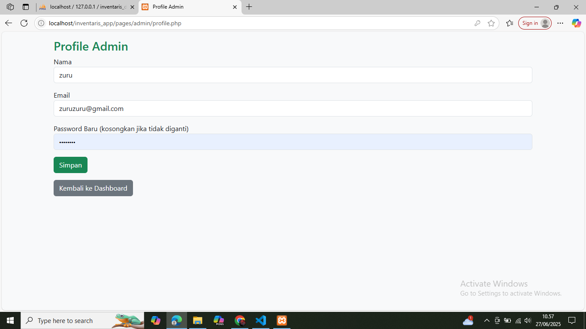

# 💻 Sistem Inventaris Laboratorium

Aplikasi berbasis web untuk manajemen inventaris barang di laboratorium komputer. Dibuat menggunakan PHP dan Bootstrap.

## 📌 Fitur Utama

- ✅ Autentikasi Admin (Login & Register)
- ✅ Manajemen Inventaris (Tambah, Edit, Hapus)
- ✅ Riwayat Peminjaman & Pengembalian Barang
- ✅ Profil Admin (Edit Nama, Email, dan Password)
- ✅ Navigasi cepat antar halaman

---

## 📁 Struktur Folder

inventaris_app/
│
├── includes/
│ └── navbar.php
│
├── pages/
│ ├── admin/
│ │ ├── inventaris.php
│ │ ├── tambah_inventaris.php
│ │ ├── edit_inventaris.php
│ │ ├── hapus_inventaris.php
│ │ ├── profile.php
│ │ └── user.php
│ │
│ ├── riwayat/
│ │ ├── riwayat.php
│ │ ├── tambah_riwayat.php
│ │ ├── edit_riwayat.php
│ │ └── hapus_riwayat.php
│ │
│ ├── index.php
│ ├── login.php
│ ├── logout.php
│ └── register.php
│
├── screenshots/
│ ├── dashboard.png
│ ├── inventaris.png
│ ├── login.png
│ ├── profile.png
│ ├── register.png
│ ├── riwayat.png
│ ├── tambah_inventaris.png
│ └── tambah_riwayat.png
│
├── sql/
│ └── database_tables_only.sql
│
├── auth.php
├── db.php
├── .gitignore
└── README.md

---

## 📸 Tampilan Aplikasi

### 🔐 Login  

### 📝 Register  

### 🏠 Dashboard  

### 🧾 Inventaris  

### ➕ Tambah Inventaris  

### 📋 Riwayat  

### ➕ Tambah Riwayat  

### 👤 Profil  

### logout
akan otomatis kembali ke halaman login ketika user mengklik

---

## 🚀 Cara Menjalankan Aplikasi (Localhost)

1. Install [XAMPP](https://www.apachefriends.org/)
2. Salin folder proyek ini ke:
3. Jalankan **Apache** dan **MySQL** dari XAMPP
4. Buka `http://localhost/phpmyadmin`, buat database baru (misalnya `inventaris_db`)
5. Import file SQL:  
`sql/database_tables_only.sql`
6. Akses aplikasi dari browser:  
👉 `http://localhost/inventaris_app/pages/login.php`

---

## 🛠️ Teknologi yang Digunakan

- PHP 8
- MySQL
- Bootstrap 5
- HTML5 & CSS3
- XAMPP (Local Development)

---

## 👨‍💻 Tentang Pengembang

Dibuat oleh **Zulkifli**  
GitHub: [Zulkifli2000](https://github.com/Zulkifli2000)

---

## 📄 Lisensi

Proyek ini bebas digunakan untuk keperluan edukasi.
